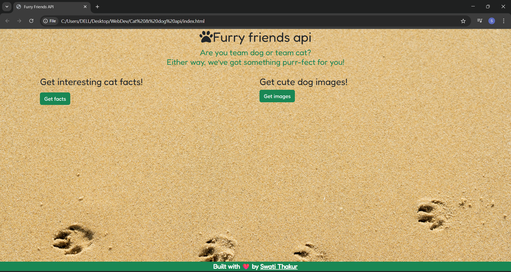

# Furry friends api

A simple and fun web app that lets you explore random **cat facts** and **dog images** using public APIs. Built with HTML, CSS, JavaScript, Axios, and lots of love! ❤️
---

## 🚀 Features

- 🐱 Fetches random **cat facts** from [catfact.ninja](https://catfact.ninja)
- 🐶 Displays cute **dog images** from [dog.ceo](https://dog.ceo/dog-api/)
- 📱 Fully responsive with **Bootstrap 5**
- 🎨 Aesthetic design using **custom fonts, icons**, and a background image
- ✨ Built with clean and readable code, perfect for beginners

---

## 🛠️ Tech Stack

- HTML5
- CSS3
- JavaScript (ES6)
- [Axios](https://axios-http.com/)
- Bootstrap 5
- Font Awesome Icons
- Google Fonts – Fredoka

---

## 📸 Demo Screenshot

---

## 🚀 Live Demo
Are you team dog or team cat?  
Either way, we’ve got something purr-fect for you!

🌐 [Furry friends api website](https://codebyswatii.github.io/-Simon-Says-Challenge/)  

## 📩 Feedback

If you have suggestions or feedback, feel free to reach out or open an issue.

---

👩‍💻 Built with 💙 by [Swati Thakur](https://github.com/codebyswatii)

<!-- Trigger GitHub Pages rebuild -->

